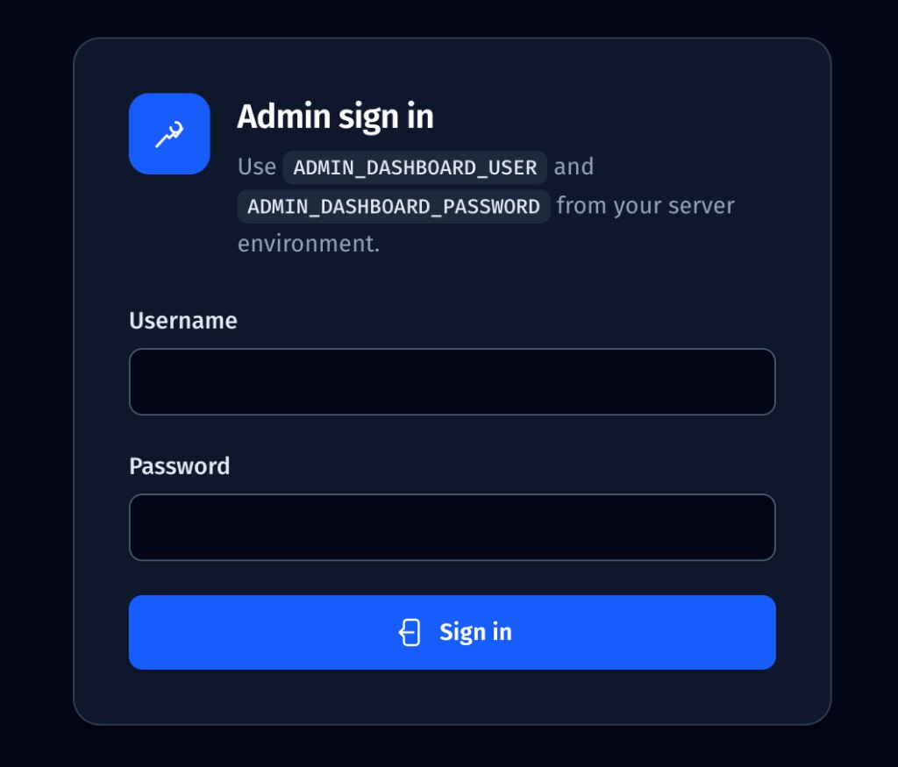
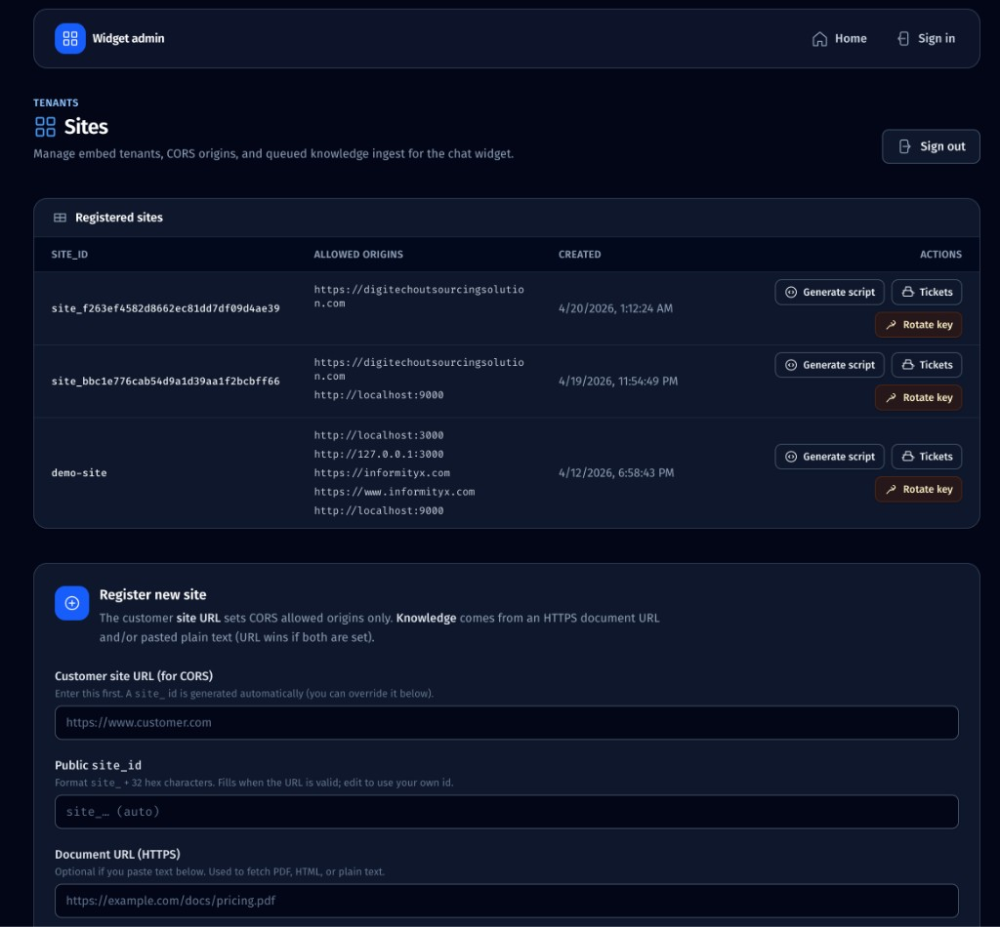
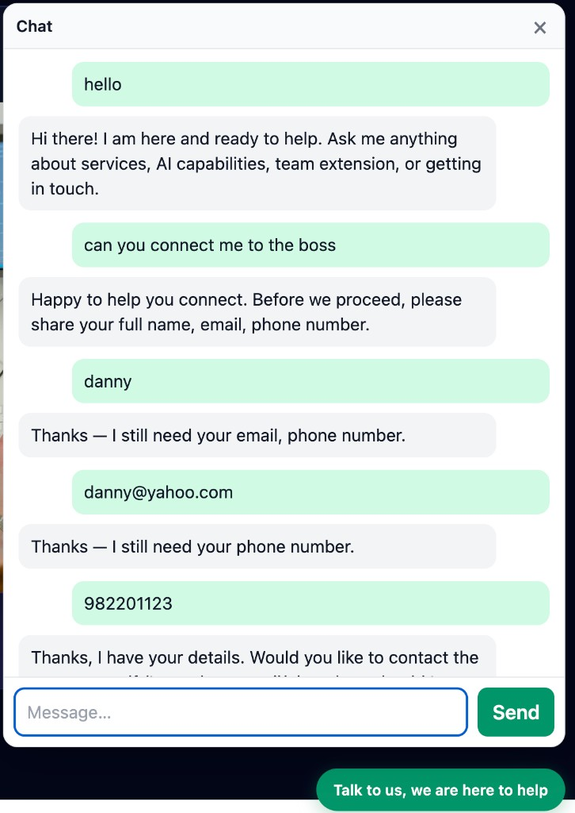

# greenfield-chat-widget

Embeddable **chat widget** and **Next.js** backend for a multi-tenant, **RAG-ready** assistant. Product direction, compliance notes, and phased delivery are defined in [`PROJECT_BOOTSTRAP_SPEC.md`](PROJECT_BOOTSTRAP_SPEC.md) (duplicate: [`docs/PROJECT_BOOTSTRAP_SPEC.md`](docs/PROJECT_BOOTSTRAP_SPEC.md)).

**Stack (current):** npm workspaces monorepo · Next.js App Router (`apps/web`) · Vite IIFE widget (`packages/widget`) · Prisma + PostgreSQL + **pgvector** · OpenAI (**streaming chat + embeddings**, RAG retrieval, citation SSE).

---

## Repository layout

| Path | Purpose |
|------|---------|
| [`apps/web/`](apps/web/) | Next.js app: UI, `POST /api/chat` (streaming), internal ingest stub, serves `public/widget.js` |
| [`packages/widget/`](packages/widget/) | Vite build → single-file IIFE copied to `apps/web/public/widget.js` |
| [`prisma/`](prisma/) | Schema, migrations (`vector` extension + `sites`, `ingest_jobs`, `document_chunks`) |
| [`ingest/`](ingest/) | Optional future Python ingest (spec §13 prefers TypeScript on Vercel) |
| [`docs/`](docs/) | Bootstrap spec copy and other docs |

---

## Product reference (screenshots)

Visual tour of what this repo ships: **admin sign-in** → **widget admin** (sites, register, ingest) → **embeddable chat** on a customer page. Image files live in [`ingest/reference/`](ingest/reference/).

### Admin sign in

Gate for `/admin` using `ADMIN_DASHBOARD_USER` and `ADMIN_DASHBOARD_PASSWORD` from the server environment.



### Widget admin (sites & ingest)

Register tenants, set CORS from the customer URL, attach an HTTPS document and/or pasted text for RAG, then **Generate script**, **Tickets**, or **Rotate key**. Allowed origins are shown in full, one per line.



### Embeddable chat on a customer page

Launcher and in-page chat after the embed script is installed; answers use ingested content for that `site_id`.



---

## Prerequisites

- **Node.js** ≥ 20 (see root [`package.json`](package.json) `engines`)
- **PostgreSQL** with **pgvector** (e.g. **Neon** via Vercel Storage)
- **OpenAI** API key (chat + embeddings for RAG / ingest)

---

## Environment variables

Copy [`.env.example`](.env.example) and set values. **Next.js** loads env from **`apps/web/`** (e.g. `apps/web/.env.local`). **Prisma CLI** (run from repo root) loads **`.env`** at the **repo root** by default—keep `DATABASE_URL` in **both** places during local dev if you use `.env.local` only under `apps/web`.

| Variable | Used by | Purpose |
|----------|---------|---------|
| `DATABASE_URL` | Prisma, RAG, ingest | Postgres connection string |
| `OPENAI_API_KEY` | Chat, ingest, ingest step | OpenAI API |
| `CHAT_MODEL` | `/api/chat` | Chat model id (default: `gpt-4o-mini`) |
| `EMBEDDING_MODEL` | `/api/chat`, ingest, step worker | Default `text-embedding-3-small` (must match index / `vector(1536)`) |
| `PUBLISHABLE_KEY_PEPPER` | `/api/chat` tenant auth, `prisma db seed` | Server secret for HMAC of publishable keys |
| `RAG_TOP_K` | `/api/chat` | Chunks to retrieve (default `8`, max `25`) |
| `CRON_SECRET` / `INGEST_CRON_SECRET` | `/api/internal/ingest/step` | Protects cron/internal ingest |
| `ADMIN_SECRET` | Admin session + encrypted publishable key storage | Required for `/admin` APIs; also used to **AES-GCM encrypt** publishable keys for one-click **Copy embed** (never plaintext-only in DB) |
| `ADMIN_DASHBOARD_USER` / `ADMIN_DASHBOARD_PASSWORD` | `POST /api/admin/login` | Dashboard sign-in (set explicitly; for local dev you can use `admin` / `admin`) |
| `ADMIN_DEMO_PUBLISHABLE_KEY` | Admin “Copy embed” for `demo-site` only | Optional; must match the hashed key in DB (e.g. same as `SEED_DEMO_PUBLISHABLE_KEY` / default `pk_test_demo`) so the script can copy without rotating |

---

## Setup

```bash
# Install dependencies (runs prisma generate via postinstall)
npm install

# Apply migrations (from repo root; requires DATABASE_URL in root .env)
npm run db:migrate

# Seed demo tenant (requires PUBLISHABLE_KEY_PEPPER; same value in apps/web/.env.local)
PUBLISHABLE_KEY_PEPPER=your-secret npm run db:seed

# Dev server (Next.js; widget script injected in development in layout)
npm run dev
```

Open [http://localhost:3000](http://localhost:3000). The floating **Chat** control uses **`demo-site`** / **`pk_test_demo`** in development after seeding.

### Admin dashboard

With **`ADMIN_SECRET`**, **`ADMIN_DASHBOARD_USER`**, and **`ADMIN_DASHBOARD_PASSWORD`** set in `apps/web/.env.local` (alongside **`PUBLISHABLE_KEY_PEPPER`** and **`OPENAI_API_KEY`**):

1. Open [http://localhost:3000/admin/login](http://localhost:3000/admin/login) and sign in.
2. Register a **site_id**, **customer site URL** (sets `allowed_origins` / CORS only), and a **knowledge** source: HTTPS **document URL** and/or **pasted text** (URL wins if both are set). The server fetches the document, extracts text, chunks it, and queues an **`IngestJob`**.
3. Use **Run ingest (batches)** on the success panel (or your existing cron calling **`GET /api/internal/ingest/step`**) until embeddings finish.

The response shows the **publishable key once**—copy it for `data-publishable-key` on the embed script.

On the sites table, **Copy embed** calls **`GET /api/admin/sites/:siteId/embed-snippet`** (with your browser origin) and copies the full `<script …>` tag. Publishable keys are stored **hashed for the widget** and **encrypted for the admin UI** using **`ADMIN_SECRET`** (see migration `publishable_key_encrypted`). Sites created before that column existed, or created without `ADMIN_SECRET`, copy a snippet with **`PASTE_PUBLISHABLE_KEY_HERE`** until you use **Rotate key** once (or re-seed `demo-site`). **Tickets** opens `/admin/sites/<site_id>/tickets`.

### Ingest sample content (Phase B)

From **`apps/web`** with env loaded (e.g. `.env.local`):

```bash
cd apps/web
npm run ingest -- --site demo-site --text ./content/sample.md
# optional PDF:
# npm run ingest -- --site demo-site --pdf ./path/to/file.pdf
```

**Queued (batched) ingest** for Vercel-length limits: add `--queue`, then call `GET /api/internal/ingest/step` with `CRON_SECRET` / `INGEST_CRON_SECRET` until the job finishes (or rely on Vercel Cron).

### Production build

```bash
npm run build
```

Builds **`@greenfield/widget`** first, copies `widget.js` into `apps/web/public/`, then builds Next.

### Lint

```bash
npm run lint
```

---

## Widget embed

Build outputs **`widget.js`**. Host it from the Next app (e.g. `/widget.js`) or a CDN. Attributes:

```html
<script
  src="https://YOUR_HOST/widget.js"
  defer
  data-site-id="YOUR_SITE_ID"
  data-publishable-key="YOUR_PUBLISHABLE_KEY"
  data-locale="en"
></script>
```

The script resolves the API base URL from its own `src` origin and `POST`s to `/api/chat?site_id=...&publishable_key=...` with **SSE**: `data: {"text":"..."}` token deltas, then `event: citations` with `chunkId`, `title`, `sourceUrl`.

---

## API (summary)

| Method | Path | Description |
|--------|------|-------------|
| `POST` | `/api/chat` | Loads **`Site`** from DB; verifies **HMAC** publishable key; **CORS** from `allowed_origins`; **RAG** retrieve → stream chat; SSE **`citations`** event |
| `OPTIONS` | `/api/chat` | CORS preflight; pass **`site_id`** and **`publishable_key`** as **query params** (same as POST URL) |
| `GET` | `/api/internal/ingest/step` | Processes up to **8** pending **`IngestJob`** chunks (embed + insert); requires cron secret |
| `POST` | `/api/admin/login` | Sets signed **httpOnly** session cookie (`ADMIN_SECRET` + dashboard user/password) |
| `POST` | `/api/admin/logout` | Clears admin session |
| `GET` | `/api/admin/me` | Returns **401** if session invalid |
| `GET` / `POST` | `/api/admin/sites` | **GET** lists tenants; **POST** creates **`Site`**, optional RAG queue from document URL / paste |
| `POST` | `/api/admin/sites/:siteId/rotate-publishable-key` | Issues a new **`pk_…`**, updates hash + encrypted copy (when **`ADMIN_SECRET`** is set) |
| `GET` | `/api/admin/sites/:siteId/embed-snippet` | Returns full embed HTML; header **`x-embed-origin`**: script `src` host; uses vault / demo env / placeholder key |
| `GET` | `/api/admin/sites/:siteId/tickets` | Lists recent **`Ticket`** rows for that site |
| `POST` | `/api/admin/ingest/run-once` | Same batch worker as ingest step, gated by admin session (no cron secret in browser) |

Tenant config lives in **`sites`** ([`prisma/schema.prisma`](prisma/schema.prisma)); bootstrap with [`prisma/seed.ts`](prisma/seed.ts).

---

## Deployment (Vercel)

- Set the Vercel project **Root Directory** to **`apps/web`**.
- Configure [`apps/web/vercel.json`](apps/web/vercel.json): monorepo `installCommand` / `buildCommand`, cron for ingest step, cache headers for `widget.js`.
- Add the same environment variables in the Vercel dashboard.
- Run **`prisma migrate deploy`** against production (CI or manual), not only `migrate dev`.

---

## Database schema (Prisma)

Models: **`Site`** (tenant + origins + key hash), **`IngestJob`**, **`DocumentChunk`** with **`vector(1536)`** for OpenAI `text-embedding-3-small`-sized embeddings. Migrations live under [`prisma/migrations/`](prisma/migrations/).

---

## Changelog

Add a new **dated** subsection for each meaningful change (features, fixes, infra). Use **ISO date** and a short bullet list.

### 2026-04-19

- **Admin dashboard** at `/admin`: env-based login, register **`Site`** + CORS from customer URL, knowledge from HTTPS **document URL** or **paste**, queued **`IngestJob`**; `POST /api/admin/ingest/run-once` runs one embed batch with session auth; shared ingest processor in `lib/ingest/process-ingest-batch.ts`; document fetch helper with SSRF limits in `lib/ingest/fetch-document.ts`.

### 2026-04-12

- Initial monorepo: npm workspaces, `apps/web` (Next.js 16), `packages/widget` (Vite IIFE), root Prisma + initial migration with **pgvector**.
- `POST /api/chat`: tenant/CORS stub, SSE compatible with the widget.
- `GET /api/internal/ingest/step`: secured stub for future chunked ingest + Vercel Cron.
- Docs: `docs/PROJECT_BOOTSTRAP_SPEC.md`; optional `ingest/` placeholder.
- **OpenAI**: streaming **Chat Completions** in `/api/chat` using `OPENAI_API_KEY` and `CHAT_MODEL` (default `gpt-4o-mini`); `EMBEDDING_MODEL` reserved for RAG.
- Tooling: ESLint ignore for built `public/widget.js`; Turbopack root set for monorepo; `openai` SDK in `apps/web`.
- **Phase B (RAG MVP):** `PUBLISHABLE_KEY_PEPPER` + Prisma **`Site`** resolution in [`apps/web/lib/site.ts`](apps/web/lib/site.ts); pgvector **retrieval** and **citations** SSE in [`apps/web/app/api/chat/route.ts`](apps/web/app/api/chat/route.ts); **`lib/rag/*`** (chunk, embed, retrieve, insert); **ingest CLI** [`apps/web/scripts/ingest-file.ts`](apps/web/scripts/ingest-file.ts) (`pdf-parse`, `dotenv`); **batched** [`apps/web/app/api/internal/ingest/step/route.ts`](apps/web/app/api/internal/ingest/step/route.ts); widget **sources** UI in [`packages/widget/src/main.ts`](packages/widget/src/main.ts); sample [`apps/web/content/sample.md`](apps/web/content/sample.md).
